# LITM Internship Program Test

## Project Overview 

This project is a starting point for a event Flutter + Firebase application. The goal of this project is to connect users to their communities by increasing awareness of the different events near me. 

## Project Logic & Architecture

I first started with setting up my environment installing the correct packages needed in order to run Flutter and Firebase on my laptop. From there I registered with Firebase and explored the different features. I made sure a blank application was able to run on my Visual Studio Code and Android Studio. 

Once a empty application was running I did some research as to what color palette I would use and the different types of user interface designs that could be used. I looked through various UI screenshots other developers posted and looked up popular apps that were made using flutter for inspiration. 

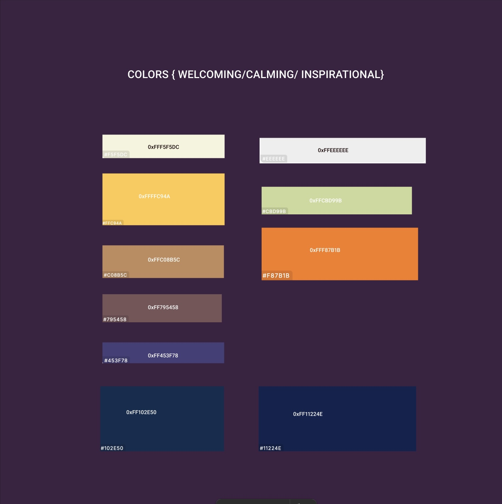

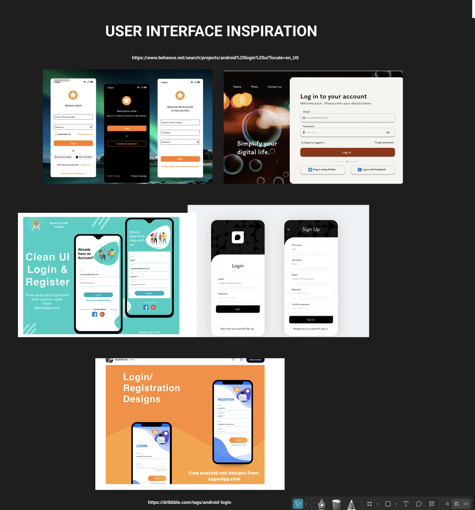

After gathering research, I decided to create a static prototype on Figma as to how each page would look like using the different colors and the overall layout. From that point after watching videos on how to setup Firebase with Flutter I decided to create a diagram in order to help break down the order of how the pages were going to interact from one another and what would be the page flow. 

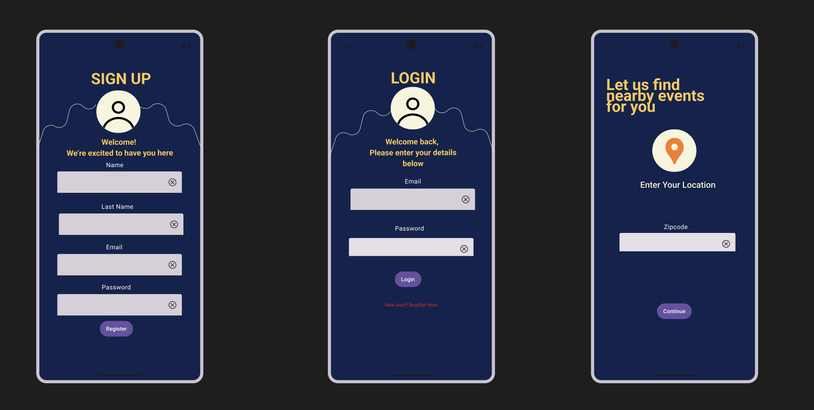

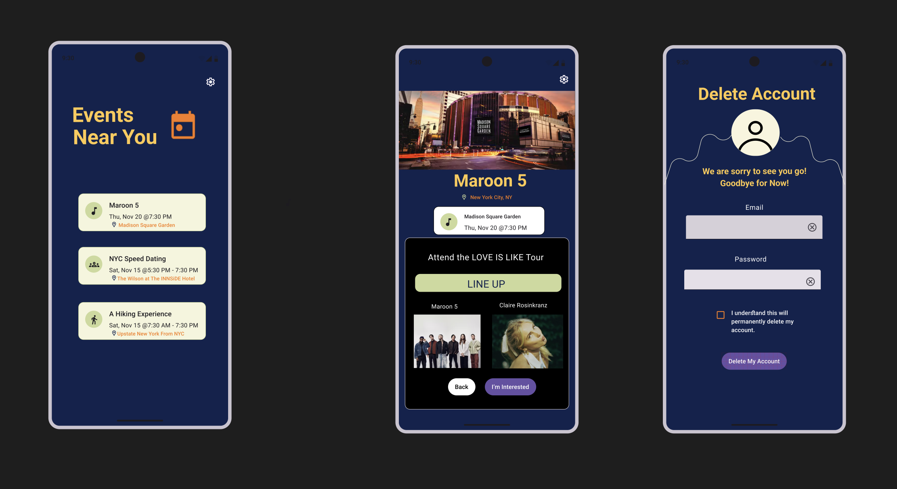

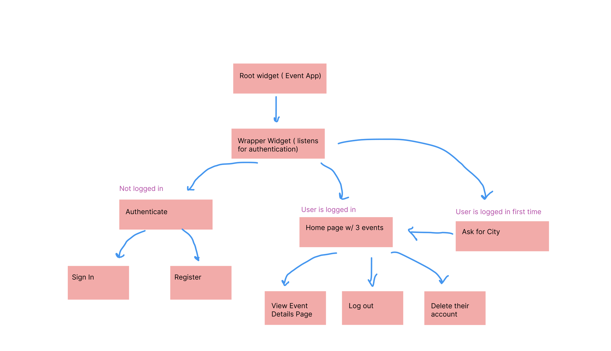

I first created the static pages using different elements for the register, zipcode and login page. After that, I tried to go back and add functionality to each page using the database which is where I made my first mistake. I should have made some simple elements at first, worked on the functionality and then gone back to made design edits. 

In terms of the database I used Colletion Query rather than Document Retrievel since the user is logging in with their email and the user ID that is generated everytime a user is created. That user ID is for us to be able to have and not have duplicates in the database in the backend. This is a difference that I noticed between MySQL and Firebase, that was a challenge to understand at first. 

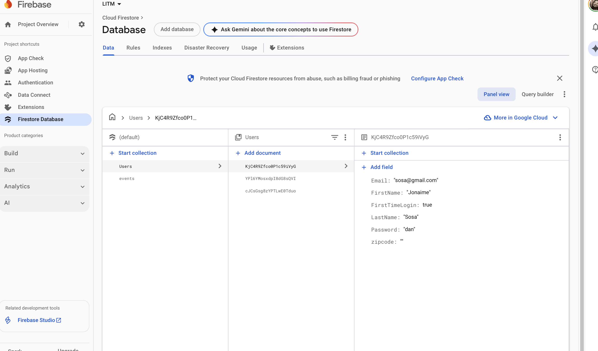

## Notes

There is a lot of missing error handling throughout the project that if I had more time I would add. I would add SHA256 hash encryption for everytime that the user registers and store that into the firebase database instead of the actual password like it currently is right now. I would also take into account edge cases such as when a user registers with all the forms empty, it should throw an alert saying that the form is empty. I would also include a password minimum and like a small hover over box that would include requirments when creating a password. Further, including creating a session everytime a use logs in and maintain that until they log out.

This was my first time using Flutter, Dart, and Firebase as my tech stack for a fullstack project. I have previously used android studio in one of my courses which seems a bit similar to Dart. Using Firebase's Firestore database was different from using MySQL that I have used in the past, so that was were I struggled more. Specifically, I had difficulty connecting my app to Firebase and pulling data from it. It was similar to my capstone project in theory now that I realize it but it didn't seem that way at first. 

## Time Breakdown

For my project management tool I decided to use Jira for the first time in order to break down tasks and create a visualizing as to what I needed to accomplish.

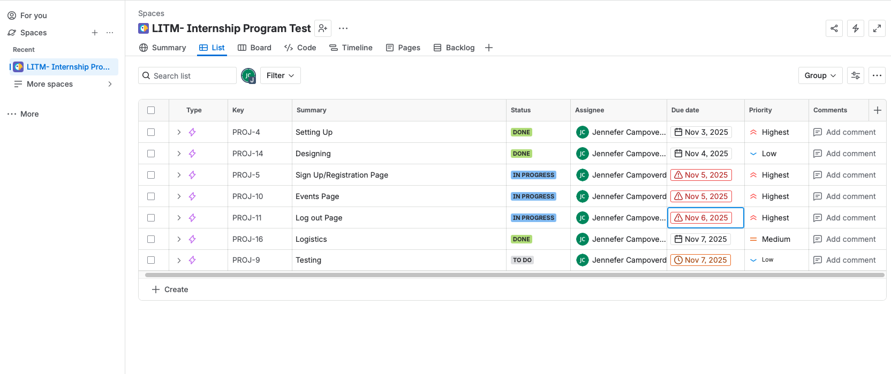

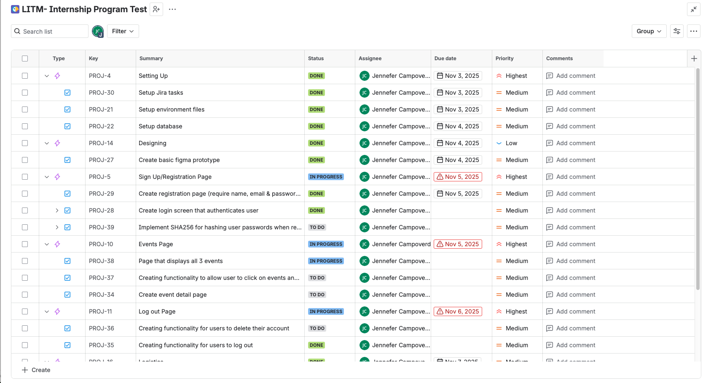

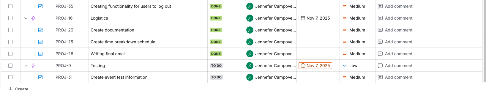

Estimated Time Break Down

Conceptualizing the solution                       -                 Time Spent:  6 hours

Organizing the project                            -                      Time Spent: 2 hours  

Coding                                            -                        Time Spent: 10 hours

Testing/Debugging                                  -                       Time Spent: 7 hours

## Installation 

To run this application, you will need to have Firebase and Firebase installed in your computer. As well as have an Firebase account set up. Run flutter pub get in order to download all the necessary dependcies needed in order this project. From there you will have to configure your Firebase account with your local enviornment. You can use Visual Studio Code or Android Stuido to run the app, but you will also need to have access to a emulator or a connect device in order to preview the application.

## Getting Started 

To run the app, using Android Studio you must select a device from your list of emulators or a physical device you have connected. You can then click the "Run" play button on the top right hand side. 

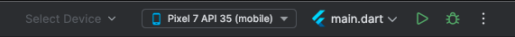 

Select new user and you be prompted to a login page where you will fill in the details if you have an account. If you do not have an account you will have to click "New User?Register Here" and from there sent to the registration page, where you will fill out your information.

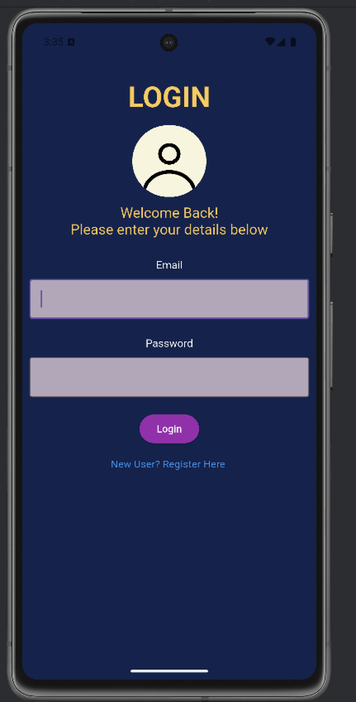

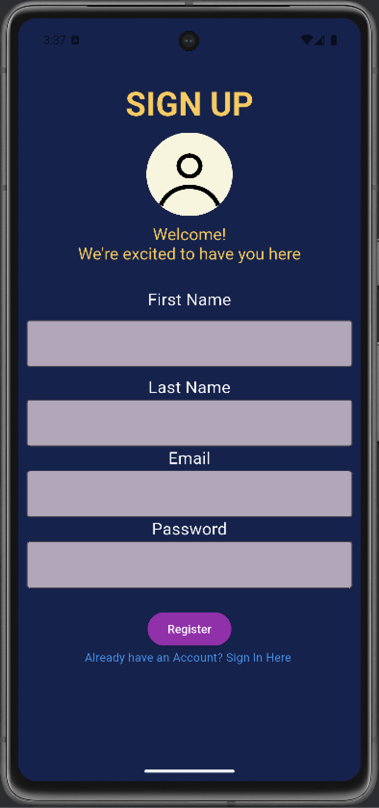

## Getting Started 

## Resources Used

 Webiste for design: 

https://designcode.io/figma-handbook-exporting-assets

https://medium.com/@pomis172/mastering-inputdecoration-in-flutter-cfc756a2d14f

https://stackoverflow.com/questions/49806705/use-of-defaulttextstyle-in-flutter

https://dribbble.com/shots/7357301-Wevent-Event-Page

https://dribbble.com/shots/24614805-Delete-Account-User-Interface

https://docs.flutter.dev/release/breaking-changes/buttons

 Youtube videos for reference: 

https://www.youtube.com/watch?v=T96Pue6ePGA

https://www.youtube.com/watch?v=LFlE8yV7lJY

https://www.youtube.com/watch?v=4iQeSN1zGs4

https://www.youtube.com/watch?v=PS0b2gJ04Bs

 Documentation for reference: 

https://firebase.google.com/docs/flutter/setup?platform=ios

https://firebase.google.com/docs/reference/admin/dotnet/class/firebase-admin/auth/hash/sha256

 Product Management tool Jira:

https://campoverdejennefer.atlassian.net/jira/software/projects/PROJ/list?direction=ASC&sortBy=timeoriginalestimate&atlOrigin=eyJpIjoiMjg1YmVmNWJjMGY0NGYwYWEzODJjM2VkY2FhZTE4OTkiLCJwIjoiaiJ9
